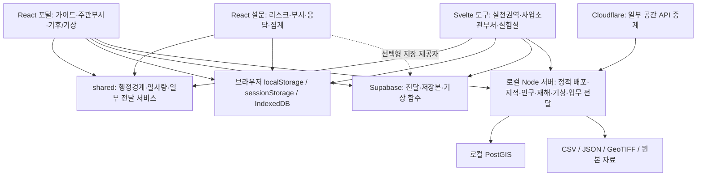

# LivingLabs 전체 구조 진단 — 2026-09-07

## 현재 작업 방향 — 2026-09-07 사용자 결정

**추가 기능 구현을 우선하고, 전체 구조 개선과 이번 진단의 수정 사항은 후속 검토로 보류한다.**

이 문서는 나중에 구조 개선을 재개할 때 참고할 진단 기록으로 보관한다. 아래의 판단과 수정 순서는 당시 검토자의 제안이며, 현재 작업의 실행 우선순위를 뜻하지 않는다. 보류는 문제 해결 완료를 의미하지 않는다.

우선 검토할 기능 목록(나열 순서는 우선순위가 아님):

- 적합한 필지 선택 기능 보완
- 결과 리포트 생성·출력 기능 및 새로운 탭 추가
- 모델 계산에 사용한 가정 표시
- WBGT를 기온·열환경 관련 지표에 추가

전체 데이터·계산·코드 구조 정리는 위 기능 작업 이후 다시 검토한다. 구체적인 기능 구현 순서는 아직 정하지 않았다.

추후 재개할 때는 A1–A8, B1–B5의 근거를 당시 최신 코드와 대조하고, 추가 기능으로 달라진 데이터·계산·저장 흐름을 반영해 수정 범위를 다시 정한다. 이 문서의 기록만으로 이미 수정됐거나 여전히 같은 문제가 있다고 단정하지 않는다.

관련 노션 기록: [LivingLabs 전체 구조 진단 및 개선 순서](https://app.notion.com/p/3d409e8c91f8811b8d88d1c6232685ef)

## 판단

현재 플랫폼은 기능별 실험과 실제 데이터 연결이 상당히 진행된 통합 프로토타입이다. 그러나 플랫폼 공통의 업무 식별자, 데이터 계약, 계산 결과 보존, 검증 기준이 구현을 따라가지 못했다. 파일명과 폴더만 정리해서 해결할 단계는 아니다. 먼저 데이터·계산·저장의 정확성을 안정화하고, 기존 화면을 유지하면서 내부 책임을 분리하는 편이 타당하다.

React와 Svelte를 함께 쓰는 것 자체는 결함이 아니다. 문제가 되는 것은 두 환경에서 같은 업무 규칙을 각자 구현하고, 저장소와 계산을 화면이 직접 제어한다는 점이다. 전체 재작성이나 프레임워크 교체를 먼저 권하지 않는다.

## 검토 범위와 한계

- 현재 작업 폴더의 수정 중인 파일까지 포함해 검토했다. Git에 이미 있던 사용자 변경은 수정하지 않았다.
- 포털·가이드·도구 진입점, 설문 관리/응답/검토/집계, 주관부서 도구, 사업소관부서 도구, 실천권역(폭염·홍수·생태계), 전국 기후위험 실험실/공개 시연, 기후전망/기상분석, 계획·예산 최적화 실험실, 적응경로 준비 화면, 전국 지표 현황을 구조 범위에 포함했다.
- shared, 기후·공간 데이터 생성 스크립트, 로컬 데이터 서버, Supabase 함수/스키마 문서, Cloudflare 중계 및 두 배포 워크플로를 확인했다.
- 화면/공통 소스 200개에 구문 검사를 실시했다. 모든 파일을 같은 깊이로 수작업 정독한 것은 아니며, 업무·계산·저장 경계를 우선 추적했다.
- 전체 원본 래스터·전국 DB의 모든 행 검증, 실제 Supabase 정책 조회, 배포 사이트 전체 UI 회귀, 정밀 열환경 모델의 과학적 검증은 수행하지 않았다.
- 배포/운영 서버를 재시작하거나 DB 데이터를 변경하지 않았다. 전체 빌드와 타입 검사는 실행하지 않았다. 구문 검사 통과를 빌드·타입·업무 정확성 통과로 해석하면 안 된다.
- 외부 사용자/데이터에 영향을 주지 않도록 경계 조건 재현은 메모리 안의 가상 데이터로 실시했다.

## 현재 구조

저장 공간이 여러 개인 것은 가능하다. 하지만 현재는 같은 업무를 어떤 키로 식별하고, 어느 저장소를 정본으로 삼으며, 장애 시 무엇을 보여줄지에 대한 공통 규칙이 부족하다.

## 기능별 현재 상태

| 영역 | 확인한 구현 | 구조 판단 |
|---|---|---|
| 포털·가이드·도구 목록 | React 라우터와 도구 URL 연결 | 진입점은 구성됨. 배포 방식별 경로와 상태 정보 정리가 필요 |
| 설문 | API → local/Supabase/Java 제공자 분리 | 좋은 분리 지점이 있으나 지역 분리·관계 무결성·제공자 동작 계약이 불완전 |
| 주관부서 | 실제 후보지 전달/배치 작업 + mockGateway 기반 성과 차트 | 실제 업무와 시연 지표가 같은 화면에 존재 |
| 사업소관부서 | 사업 배치·수량·간이 온도 저감·검토 회신 | 간이 계산 엔진은 분리됐으나 수량/단위/계산 결과 이력이 미완성 |
| 실천권역·전국 재해 실험실 | 지표 로딩·H/E/V 계산·필지 후보·저장 | 화면이 계산·저장까지 소유. 실제 재현 오류 확인 |
| 기후전망·기상 | AR5 IC4 시군구 전망, 관측·LST, Supabase 기상 읽기 | 자료 종류·기준연도·서비스 범위를 통합 계약으로 관리해야 함 |
| 계획·예산 최적화 실험실 | 정적 카탈로그 기반 예산 배분/배치, 임계값 경로 | 제한된 실험 구현. 제약식 기반 공간 최적화로 간주하면 안 됨 |
| 적응경로 기본 메뉴 | 준비 중 페이지 | 실험실의 경로 기능과 정식 메뉴 기능이 분리된 상태 |
| 전국 지표 현황 | manifest의 생성 상태 표시 | 생성 완료와 실제 API 이용 가능/분석 적합 상태는 구분 필요 |
| 운영·배포 | 로컬 통합 서버, GitHub Pages, Cloudflare | 실행 환경마다 제공 가능한 API가 다름. 운영 구조 재현 문서가 뒤처짐 |

## 우선 해결할 문제

### A1. 격자 저장 후 복원 계약이 깨진다 — 재현 확인

근거:
- riskmap-core-main/src/lib/tools/PriorityManagementArea.svelte:544 — IndexedDB 저장 전에 JSON 왕복 변환.
- 같은 파일:555 — 분석 결과와 지표를 저장본에 포함.
- 같은 파일:616, 882 — 복원 시 일반 객체를 분석 결과로 다시 대입.
- 같은 파일:298 — 격자 읽기는 Array / TypedArray / Map만 허용.
- 같은 파일:1812 — 원격 저장은 일부 차원 배열을 제거하지만 Risk values는 별도 인코딩 없이 유지.

실제 계산 결과의 Float32Array를 현재 저장 방식으로 왕복하면 Object가 되고 length도 사라진다. 기존 격자 판별 함수는 이를 거부한다. Map은 JSON에서 빈 객체가 된다. 따라서 저장 성공과 지도/분석 결과의 완전한 복원은 동일하지 않다. 전체 브라우저 재시작 시나리오는 별도로 검증해야 하지만 데이터 형식 손실 자체는 재현됐다.

개선: 명시적인 격자 인코딩과 디코딩, 스키마 버전, 누락값 표준을 정의한다. 원격 저장본을 요약만 보존하는 용도로 만들 경우 원본 결과 참조와 재구성 규칙을 함께 저장한다.

### A2. 결측 셀이 평균 계산에서 0으로 변한다 — 재현 확인

근거: PriorityManagementArea.svelte:1215, 1239, 1278, 1352 부근.

weightedCellMean은 유효값이 없으면 null을 반환한다. 이를 Float32Array에 대입하면 0으로 변한다. summarizeGridValues는 이 0을 유효한 셀로 집계한다.

재현: H 입력 [0.8, null]에 다른 차원은 두 셀 모두 0.5를 넣었다. H의 유효값 평균은 0.8이어야 하지만 dimensionScores.H는 약 0.4가 됐다. Risk 유효 셀은 1개로 제한됐으므로, 이 재현을 “최종 Risk도 반드시 절반”이라고 확대 해석하지 않는다. 차원 요약/지도와 최종 Risk의 모집단이 달라지는 문제다.

개선: 결측값은 끝까지 NaN 또는 별도 유효 마스크로 유지하고, 차원별 유효 셀 수와 통합 계산 셀 수를 구분해 반환한다.

### A3. 공간 데이터 정렬 검증이 부족하다 — 재현 확인

근거: PriorityManagementArea.svelte:1289–1307의 computeGridAnalysis.

결합 조건은 주로 격자의 행·열 수와 배열 크기다. 좌표계, 원점, 셀 크기, 셀 순서가 같은지 검증하지 않는다.

재현: 크기가 같은 2×1 격자에서 한 입력만 EPSG:4326 및 다른 원점을 주어도 계산이 진행됐다. 현재 운영 자료가 실제로 잘못 정렬돼 있다는 뜻은 아니지만, 그런 입력을 방어할 장치가 없다.

개선: gridDefinitionId와 좌표계·원점·해상도·범위·행 방향을 계약으로 묶는다. 데이터 로딩 경계에서 일치 여부를 검사하고 불일치는 명시적으로 재투영/재격자화하거나 거부한다.

### A4. 설문 집계가 로그인 지역에 묶이지 않는다 — 코드 확인

근거:
- Survey platform for collaboration/src/app/App.tsx:284 — ResponseReview/ResultsSummary에 지역·프로젝트를 전달하지 않음.
- 같은 앱 src/app/components/screens/ResultsSummary.tsx:72 — 인자 없는 getRisks/getResponses로 전체 조회.
- ResponseReview.tsx:111 — 동일한 전체 조회.
- RiskManagement.tsx:180 부근 — 신규 리스크 projectId가 default.

한 브라우저 또는 원격 저장소에 여러 지역 자료가 함께 존재하면 지역별 검토 화면에 다른 지역 자료가 섞일 수 있다. 화면 상단의 로그인 지역만으로 데이터 범위가 보장되지 않는다.

개선: regionId와 projectId를 먼저 확정하고, 조회·집계·내보내기·저장에 동일하게 필수 적용한다. 데이터 제공자/API에서 누락된 범위를 거부하도록 한다.

### A5. 설문 관계 무결성과 저장소별 동작이 일치하지 않는다 — 일부 재현

근거:
- localProvider.ts:108 — 리스크만 삭제하고 응답/배정은 유지.
- supabaseProvider.ts의 deleteRisk도 리스크만 삭제.
- localProvider.ts:121 — 응답은 riskId+departmentId로 대체.
- supabaseProvider.ts:71 및 createResponse — id 중심 저장.
- ResultsSummary.ts — 전체 submitted 응답 수를 배정 수로 나눔.
- lib/data/types.ts — 핵심 계약이 any 기반.

메모리 재현에서 리스크 삭제 후 responses=1, assignments=1이 남았다. 이 잔존 응답은 현재 완료율 분자에 포함될 수 있다. 또한 동일 업무의 응답 중복 처리 규칙이 제공자별로 달라, 저장소 교체만으로 동작이 바뀔 수 있다. 실제 UI가 기존 응답 id를 넘기는 경로는 있지만, 제공자 자체 계약은 동일하지 않다.

개선: 응답의 고유키와 수정 이력, 삭제/보관 정책을 정의한다. 제공자별로 같은 계약 테스트를 통과시키고 집계는 현재 프로젝트의 유효 배정과 연결된 응답만 대상으로 한다.

### A6. 업무 전달의 정본·계보·완료 상태가 통일되지 않았다 — 코드 확인

근거:
- shared/services/platformHandoffs.js — kind/region/package 필터, 최신 1건 조회, 실패 시 false/[] 반환.
- riskmap-core-main/scripts/vworld-data-proxy.mjs:795–842 — 로컬 JSON 파일에서 지역 코드당 한 payload 저장.
- LeadDepartmentPrototypePage.tsx — 브라우저 저장, 창 메시지, 원격/로컬 업무 전달 처리.
- ResponsibleDepartmentTool.svelte:1172 — 회신 payload에는 originalPackageId가 있음.
- platformHandoffs.js — 공통 source_package_id는 sourcePackageId/sourcePackageID만 인식.

원격은 이력 목록, 로컬은 지역별 마지막 한 건이라는 의미 차이가 있다. “없음”과 “조회 실패”도 같은 빈 결과로 처리되는 경로가 있다. 회신의 원요청 식별자가 공통 계보 열로 정규화되지 않는 부분도 확인했다.

개선: Project/Scenario/AnalysisRun/Handoff/Review의 ID와 관계를 정의하고, 재전송 시 중복 방지, 버전 충돌, 완료/회수 전이를 서비스에서 관리한다. 네트워크 실패와 실제 빈 목록을 별도 상태로 반환한다.

### A7. 간이 효과 모델의 입력·단위·결과 보존이 불완전하다 — 일부 재현

근거:
- riskmap-core-main/src/lib/effects/temperatureEffect.js:16 — 기본 태양고도, 면적, 알베도, 계수.
- 같은 파일:32 — Number(solar값) || DEFAULT_SOLAR.
- ResponsibleDepartmentTool.svelte:1128 — 미배치 시 목표 물량 사용, 점 외 형상은 수량/폭으로 count 변환.
- 같은 파일:1172 — 회신에는 effectStatus가 있고 effectResult는 없음.
- docs/EFFECT_EVALUATION.md — 간이 미리보기임을 문서화.

재현: 일사량 0/0/0이 250/580/480으로 대체되어 양수의 차단 에너지와 온도 저감이 계산됐다. 결측과 유효한 0을 구분해야 한다.

또한 선 길이(m)와 면 면적(㎡)을 같은 count 변환으로 다루는 것은 사업별 단위 계약이 필요하다. 그늘 면적은 위치 중첩을 제거하지 않고 합산하며, 저감 비율만 1로 제한한다. 이는 현재 간이 모델의 가정/한계이지 정밀 물리 모델로 검증된 결과가 아니다.

개선: 사업별 quantityKind/unit, 사용한 기본값/출처/대체 사유, modelVersion, 입력 스냅샷, effectResult를 한 계산 실행 기록으로 저장한다. 목표 물량 기반 추정과 실제 배치 기반 계산을 구분한다.

### A8. 시연 데이터와 실제 결과를 구분하는 공통 상태가 부족하다 — 코드 확인

근거:
- src/app/lib/adapters/leadDepartmentData.ts:371, 381, 491, 507 — 정적 urbanIndex/sectorScores와 mockGateway.
- LeadDepartmentPrototypePage.tsx:2613 — 해당 값을 차트에 사용.
- PriorityManagementArea.svelte:922, 1080–1129 — 원자료 로딩 실패 시 삼각함수 등으로 생성한 대체 격자 사용.
- 같은 파일:1699 — 시연 대체값 포함 문구 표시.
- riskmap-core-main/src/lib/data/practiceDistricts.js — 시연용 상대 분류 기준.

시연 표시가 전혀 없는 것은 아니다. 대체 격자에는 demoFallback과 설명 문구가 존재한다. 문제는 장애가 나면 일반 배포 경로에서도 대체 패턴으로 계산을 계속하고, 실제 업무 전달/선정과 공통 품질 등급으로 분리되지 않는다는 것이다.

개선: observed/modelled/proxy/demo/missing 같은 데이터 성격과 runStatus를 계산 결과 수준에서 보존한다. 실제 의사결정 모드는 누락 시 중단하고, 시연 모드는 명시적으로 선택하게 한다. 화면·저장·전달·리포트에 동일 상태를 유지한다.

## 구조적으로 개편할 영역

### B1. 핵심 화면의 책임 과다와 계산 복제

확인한 파일 규모:
- LeadDepartmentPrototypePage.tsx: 3,970줄.
- PriorityManagementArea.svelte: 3,339줄.
- SelectedRegionMap.svelte: 3,333줄.
- ClimateHazardLab.svelte: 3,037줄.
- ClimateHazardRegionMap.svelte: 2,427줄.
- ResponsibleDepartmentTool.svelte: 1,654줄.
- vworld-data-proxy.mjs: 1,724줄.

줄 수 자체가 결함은 아니다. 실제로 화면에 자료 로딩, 기본값 결정, 정규화 이후 집계, 분석 실행, 대안 버전, 브라우저 DB, 원격 전달이 함께 있다.

PriorityManagementArea와 ClimateHazardLab은 둘 다 실제 라우트에서 사용된다. 공백 제거 후 25자를 넘는 Priority 측 1,779개 행 중 1,407개가 Lab에도 존재했다. 이는 엄밀한 AST 코드 중복률은 아니지만 큰 복제 관계를 보여준다. 한쪽의 저장·결측 오류를 고쳐도 다른 쪽에 남을 수 있다.

분리 순서: 순수 계산 → 데이터 로더/저장 → 대안·전달 업무 서비스 → 지도 렌더링 → 화면 패널. 공통 엔진 위에 재해/실험 모드 설정을 전달하는 형태가 적합하다.

### B2. 데이터 카탈로그와 격자 계약의 통합 필요

현재 입력은 shared CSV/행정경계, 앱의 static/analysis-data, public/data, 로컬 PostGIS, riskmap-core-main/data/processed/hazard, 루트 원본 data와 외부 D 드라이브 자료에 분산된다. 원본/가공/서비스용 파일을 나누는 것은 타당하지만, 이를 연결하는 단일 카탈로그가 없다.

동일한 지역 정보도 설문은 공통 CSV, 지도와 주관부서는 경계 JSON 및 서로 다른 변환 함수로 만든다. 시군구 상위 코드 추정, 명칭, 중심점 규칙을 공통화해야 한다.

데이터마다 최소한 다음을 기록한다:
datasetId/version, source, observed/modelled/proxy/demo, 기간과 시간대, 변수와 단위, nativeResolution, analysisResolution, CRS/gridDefinitionId, noData 규칙, 정규화 방식/기준 모집단, coverage, 생성 코드 버전, 체크섬.

기후전망은 AR5/RCP의 2020년 모델값을 현재 비교 기준으로 만드는 스크립트가 있고, 전국 Hazard는 2021–2025 관측 집계와 SSP 미래 파일을 사용한다. 이를 같은 “현재/미래”로 느슨하게 연결하면 비교 기준이 달라진다. 100m로 변환됐다고 원자료의 실질 해상도가 100m가 되는 것도 아니다.

hazard-grid-service.mjs의 파일별 national-minmax와 지역 지표의 분위수 정규화는 목적이 다를 수 있다. 시점·지역 비교가 필요한 경우 고정된 정규화 기준을 정하고 결과에 남겨야 한다. 현재 모든 지표값이 잘못됐다고 판단한 것은 아니다.

### B3. 계획·예산 최적화는 실험 범위를 명확히 해야 한다

planning-optimization-workspace/+page.svelte:160의 예산 계산은 allocationShare 비율로 수량을 배정하고 남은 예산을 정해진 순서로 채운다. 후보지는 카탈로그에서 순환 재사용한다. 효과 최대화 목적함수나 부지 수용량/중복 설치 제한을 푸는 구조가 아니다.

기능을 유지하되 현재는 예산 배분 시뮬레이션으로 정의한다. 실제 공간 최적화 단계에서는 목적함수, 후보지 적합성, 설치 제약, 예산 단위, 중복 배치, 불확실성 기준을 별도 엔진에 둔다.

정식 adaptation-pathway 라우트는 준비 중이고 경로 실험은 lab/workspace에 있다. 메뉴·기능 상태·모델 성숙도를 하나의 기능 목록에서 관리할 필요가 있다.

### B4. 로그인/권한은 운영용 설계와 거리가 있다

설문 authenticateUser는 브라우저 저장 계정의 비밀번호와 직접 비교한다. 신규 계정의 지역과 역할도 로컬 모델이다. 다른 도구의 작업자 이름 입력은 서버가 검증한 사용자 ID가 아니다.

docs/SUPABASE_HANDOFF_SCHEMA.sql은 RLS를 켜지만 SELECT/INSERT/UPDATE/DELETE 정책을 true로 허용하는 명시적 데모 정책이다. 실제 원격 DB에 지금 같은 정책이 적용돼 있는지는 조회하지 않았다. 공개 anon 키의 존재 자체를 비밀 유출로 판단하지 않는다.

공동 업무로 전환하려면 사용자·소속기관·프로젝트 구성원·부서 권한을 서버에서 확인하고, 같은 범위를 저장/조회/초기화에 적용해야 한다. 권한은 화면을 숨기는 것만으로 보장되지 않는다. Supabase 정책 해석은 [공식 RLS 문서](https://supabase.com/docs/guides/database/postgres/row-level-security)를 대조했다.

### B5. 배포 재현성과 검증 체계가 뒤처졌다

- Cloudflare 공간 API는 로컬 컴퓨터의 PostGIS 서버로 중계한다. 호스팅이 클라우드에 있어도 데이터 제공은 해당 PC 가용성에 의존한다.
- Worker의 허용 경로에는 cadastre/population/hazard/flood/analysis가 있지만, WeatherAnalysisPage가 호출하는 /kma-network 등은 포함되지 않는다. 기본 환경에서 모든 기능이 동일하게 제공된다고 볼 수 없다.
- GitHub Pages는 /LivingLabs/ 하위 경로인데 기상 화면에는 /data/... 절대 경로 호출이 남아 있다.
- 문서는 개별 개발 서버를 4173–4175로 안내하지만 실제 DEV 설정은 5173–5175다. 미리보기와 개발 주소를 구분해야 한다.
- package.json에 존재하지 않는 수집 스크립트 2종이 연결돼 있다: collect-kma-national-heatwave.mjs(수집/테스트 두 명령), national-lst-yearly-queue.py.
- Supabase에 현재 버전 관리된 migrations 디렉터리는 없고 SQL 문서·함수만 있다. 전체 DB를 덤프로 옮기는 것과 스키마 변화 이력을 재현하는 것은 다른 문제다.
- 두 배포 워크플로는 설치→빌드→배포 중심이며 계산/저장/권한/다지역 집계 검증 단계가 없다.
- 설문 결과의 “전체 결과 엑셀 다운로드” 버튼에는 클릭 동작이 없다. 화면에 존재하는 기능과 구현 완료 기능을 구분해야 한다.

## 유지할 가치가 있는 기존 자산

- shared 행정경계·지역 CSV·일사량 자료 및 공통 지도 설정.
- 설문의 API/제공자 분리 틀. 구현 계약을 강화하면 재사용 가능.
- temperatureEffect.js의 순수 계산 함수 분리.
- 일부 데이터의 sourceResolution/rawUnit/normalization/manifest 메타데이터.
- PostGIS 도입, 파라미터화된 조회, 백업·복원과 체크섬 검증.
- 원격 임시 저장 버전, schemaVersion, sourcePackageId 계열 식별자 등 이미 시작된 이력 관리.
- 실제 후보지 전달, 사업 배치, 사용자 업무 화면.

## 권장 목표 구조

| 계층 | 책임 |
|---|---|
| 기준 데이터 | Region, GridDefinition, DatasetVersion, IndicatorDefinition |
| 업무 데이터 | Project, Survey, RiskItem, DepartmentAssignment, Response, Scenario, CandidateParcel, Intervention |
| 계산 결과 | AnalysisRun, InputSnapshot, ModelVersion, AssumptionSet, ResultArtifact, QualityFlags |
| 협업 | Handoff, Review, StateTransition, Actor |
| 서비스 | 자료 조회/검증, 계산 실행, 저장/복원, 부서 전달, 리포트 생성 |
| 화면 | 선택·입력·지도·표시. 저장 위치와 계산식을 직접 소유하지 않음 |

대형 격자/원본 자료는 파일 또는 공간 저장소에, 업무 관계와 실행 메타데이터는 DB에 둔다. JSON은 입력/가정 스냅샷 등 유연성이 필요한 곳에 사용하고, 지역·프로젝트·버전·상태·원요청 관계는 명시적인 키로 관리한다. 폴더 이동보다 이 계약의 확정이 먼저다.

## 실제 수정 순서와 완료 조건

1. **계산·복원 오류 안정화:** A1–A3, A7의 0 처리 수정. 결측/0/다른 좌표계/저장 왕복 재현 검증을 먼저 고정한다.
2. **공통 업무 모델:** 지역·프로젝트·대안·실행·전달 ID, 설문 관계 무결성과 정본 저장 정책을 확정한다. 다른 두 지역 데이터가 서로 보이지 않고 동일 응답의 재저장이 동일하게 동작해야 한다.
3. **계산 결과 계약:** 실제/모의 구분, 입력 자료 버전, 가정, 사용 단위, 검증 범위와 결과 수치를 보존한다. 과거 결과를 다시 열었을 때 무엇으로 계산했는지 설명 가능해야 한다.
4. **엔진과 저장 서비스 추출:** 현재 두 재해 화면과 지도에서 중복 로직을 단계적으로 제거한다. 간단한 H/E/V, 결측, 홍수 방향성, 사업 효과 입력의 대표 사례를 비교한다.
5. **운영 구조 정리:** 개발/시연/운영 설정, API 제공 범위, 서버/DB 마이그레이션, 복구 경로를 문서와 일치시킨다. 공동 이용을 시작하기 전에 실제 권한을 검증한다.
6. **기능 확장:** 위 계약에 맞춰 필지 적합성 보완 → 신규 열환경 지표 → 결과 리포트를 구현한다. 가정 표시는 3단계부터 제공한다.

완료 기준은 “기존 화면이 뜬다”가 아니라 “같은 검증 입력에 올바른 결과가 나오고, 저장·전달·재조회해도 의미와 근거가 보존된다”이다. 기존의 잘못된 결과까지 그대로 유지하지 않도록 기준값은 독립적으로 검증한다.

## 수행한 검증 기록

| 검사 | 결과 |
|---|---|
| 화면/공통 소스 구문 | TSX 131, TS 22, JS 13, Svelte 34 = 200개, 구문 오류 0 |
| Svelte 경고 | 미사용 CSS 76, 접근성 관련 9. 빌드/타입 검사 결과 아님 |
| 일사량 0 입력 | [0,0,0] → [250,580,480] 대체, 양수 효과 발생 |
| 설문 리스크 삭제 | risks 0, responses 1, assignments 1 잔존 |
| 결측 평균 | H=[0.8,null] → 요약 평균 약 0.4, Risk 유효 셀 1 |
| 좌표계 불일치 | 같은 2×1 크기의 다른 CRS/원점 입력이 계산에 수용됨 |
| 계산 결과 JSON 왕복 | Float32Array → Object, 기존 판별 함수 거부; Map → {} |
| 연결된 실행 스크립트 존재 | 누락 파일 2개, 영향 명령 3개 |
| 운영 DB/배포 UI/전체 빌드 | 이번 검토에서는 미실시 |

이 문서는 전체 시스템의 구조 진단과 확인된 결함 목록이다. 모든 모델의 과학적 타당성이나 운영 DB의 실제 내용까지 검증 완료했다는 보증은 아니다.

