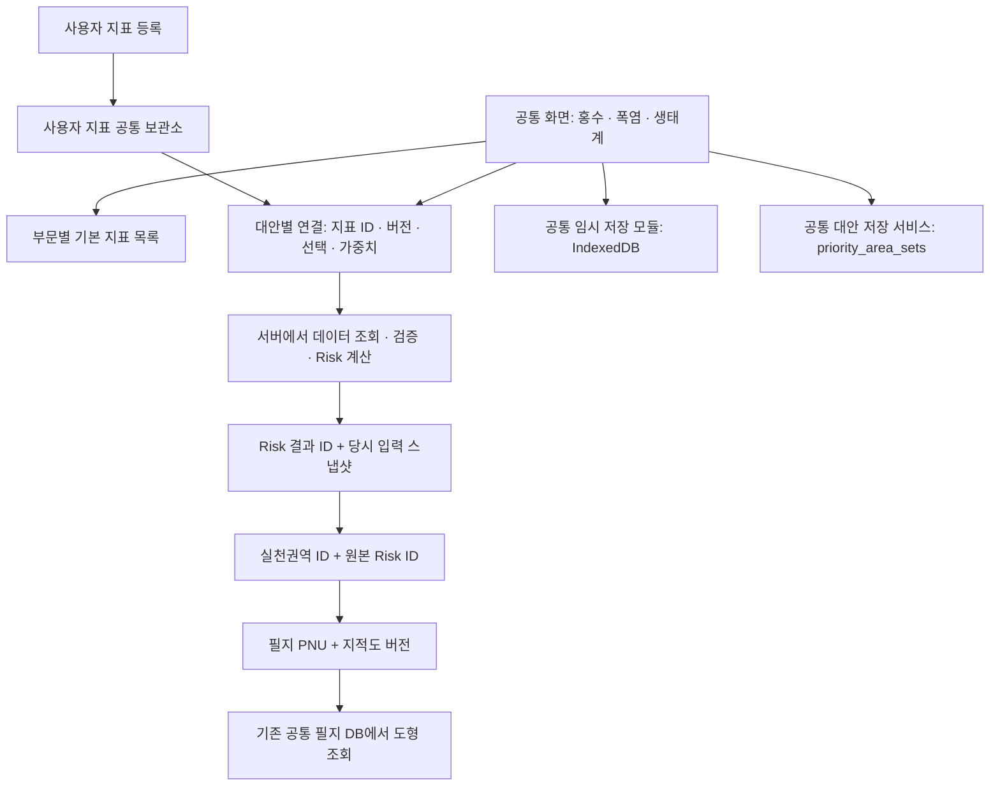

# 공통 저장소와 사용자 지표 연결 — 2026-09-29

개발 화면 `http://127.0.0.1:4173/internal-tools/priority-management-area/flood?regionCode=41110`에 적용했다. 기존 홍수 화면의 배치와 공통 조작을 유지하고 폭염·생태계도 같은 구현을 사용한다. 2026-09-30 사용자 승인으로 공통 UI·저장본 읽기·서버 분석 연계를 공개 사이트에도 배포하고 아래의 외부 검증을 완료했다. 사용자 지표 신규 등록·보관소 연결은 개발 사이트 전용이다.

## 사용자가 보는 동작

1. **+ 사용자 지표**에서 새 데이터를 등록하면, 보관소 저장이 성공한 다음 현재 대안에 연결된다.
2. 같은 창의 **보관된 사용자 지표**에서 현재 지역의 지표를 찾아 다른 대안이나 부문에 연결할 수 있다.
3. 새 대안에는 사용자 지표를 자동 복사하지 않는다. 지표 옆 **× 연결 해제**는 현재 대안의 연결만 없앤다.
4. **저장 / 불러오기 / 저장본 관리**는 부문들이 공유하는 서비스와 DB를 사용한다. 목록은 현재 부문·지역에 맞춰 조회한다. 부문이 다른 저장 결과를 잘못 불러와 섞지 않는다.
5. 생태계의 기본 지표 목록은 비어 있다. 보관된 사용자 지표를 명시적으로 붙이는 것은 가능하지만 필수 구성요소가 준비되지 않으면 Risk를 계산하지 않는다.

## 구조

| 대상 | 보관 내용 | 실제 위치 / 역할 |
|---|---|---|
| 기본 지표 | 부문별 지표 ID, 분류, 기본 선택 | 기존 지표 레지스트리 |
| 사용자 지표 | 불변 ID·버전, 지역, 설명, 출처 파일명, 격자와 값 | 개발 서버 `.runtime-data/user-indicators/<ID>/`의 `metadata.json`, `data.json` |
| 대안 설정 | 사용자 지표 ID·버전, 선택·가중치 | 대안별 설정, 반복 격자값을 넣지 않음 |
| 분석 결과 | Risk 값, 결과 ID, 당시 사용한 입력값 | 기존 결과 스냅샷을 유지해 원자료 변경과 무관하게 복원 |
| 임시 작업 | 현재 지역·부문의 대안 상태 | 공통 IndexedDB 저장 모듈, 기존 키·저장 형식 호환 |
| 명시적 저장본 | 대안들, 설정, 결과와 ID 연결 | 기존 공통 Supabase `priority_area_sets` |
| 필지 | PNU·자료 버전으로 연결 | 기존 로컬 지적도 DB, 대안마다 도형 중복 저장하지 않음 |

사용자 지표 보관소는 **현재 개발 서버의 공통 저장소**이다. 같은 서버의 모든 부문에서 사용하지만 다른 컴퓨터나 공개 사이트와 자동 동기화하지 않는다. 업로드한 원본 TIF 파일 자체를 보관하는 기능은 이번에 추가하지 않았으며, 지역에 맞춰 읽고 정규화한 값과 출처 정보를 보관한다. 서버를 옮길 때 이 디렉터리도 별도 백업·이전해야 한다. Git에는 분석 데이터를 올리지 않도록 제외했다.

## 화면에서 분리한 코드

| 모듈 | 책임 |
|---|---|
| `src/lib/priority/indicatorRepository.js` | 지표 입력 조회, 캐시 및 격자 응답 읽기 |
| `src/lib/priority/userIndicatorRepository.js` | 사용자 지표 목록·등록·ID 조회·대안 연결 |
| `src/lib/priority/gridInput.js` | 사용자 입력 정규화, 결측 유지, 시연값 생성 |
| `src/lib/priority/draftRepository.js` | 공통 IndexedDB 읽기·쓰기, 트랜잭션 완료 확인 |
| `src/lib/priority/alternativeRepository.js` | 대안 정리와 공통 저장 형식 구성 |
| `shared/services/priorityAreaDrafts.js` | 기존 공동 DB 저장·조회·이력 관리 서비스 |
| `shared/services/priorityDraftCodec.js` | 큰 저장본의 무손실 압축·복원, 이전 저장 형식 호환 |
| `scripts/user-indicator-store.mjs` | 서버 디스크에 불변 사용자 지표 저장, 지역별 목록과 ID 조회 |
| `scripts/registered-risk.mjs` | 기본 지표 ID와 사용자 지표 ID를 조회하여 계산 입력 구성 |

`PriorityManagementArea.svelte`는 화면 상태와 사용자 조작을 연결한다. 모든 화면 코드를 없애거나 서버로 옮긴 것은 아니다. 사용자 파일 읽기, 화면용 미리보기, 실천권역 구성 등 일부 처리는 여전히 브라우저에 있다. 대안·Risk·권역은 독립 ID로 연결하되, 저장본 내부 구조를 유지한다. 별도 결과 테이블로 전체 이력을 분리하는 작업은 이번 범위가 아니다.

## 데이터 규칙과 오류 수정

- GeoTIFF는 EPSG:5179, 100m, 단일 밴드, 전국 기준 격자 정렬을 검사한다. 기준이 다른 자료를 임의 변환해 등록하지 않는다.
- JSON은 현재 지역 격자의 셀 개수와 일치해야 한다. 유효 값만 정규화하며 결측은 결측으로 유지한다.
- 서버에서도 격자 크기·좌표·인덱스 중복·범위·값·지역·버전을 검증한다. API에 지역별 값으로 등록한 지표를 다른 지역 분석에 연결할 수 없다.
- 기본/등록 사용자 지표의 새 분석은 ID만 전달하는 `schemaVersion=2`를 사용한다. 오래된 사용자 지표와 저장된 결과의 H/E/V 복원에는 당시 입력을 전달하는 호환 경로를 유지한다.
- 발견한 오류: 저장된 결과를 불러온 뒤 업로드용 기준 격자가 비어 GeoTIFF 추가가 실패했다. 결과와 기준 격자를 함께 복원하도록 수정했다.
- 발견한 오류: 타입 배열의 결측이 시연값 생성 과정에서 0으로 바뀌거나 지역 밖 값이 정규화 범위에 포함될 수 있었다. 결측과 지역 마스크를 유지하도록 수정했다.
- 사용자 지표 연결을 해제하거나 대안을 전환할 때 미리보기 입력도 맞춰 갱신한다. 자료 기간 변경 시 사용자 지표 연결은 유지한다.
- 등록 실패 시 대안에 지표를 붙이지 않는다. 목록·조회·분석 실패는 오류를 표시하고 다시 시도할 수 있다.

## 확인한 범위와 증거

| 검증 | 결과 | 증거 |
|---|---|---|
| 홍수 기준 화면에서 JSON 등록 → ID 서버 계산 | 통과 | `output/common-repositories-browser/report.json` |
| 다른 대안·폭염에서 같은 사용자 지표 재연결 | 통과 | 같은 보고서 |
| 연결 해제의 대안 간 격리 | 통과 | 같은 보고서 |
| 공통 저장/불러오기 UI 왕복, Risk 값·ID 복원 | 통과, 원격 DB 응답을 테스트용으로 격리 | 같은 보고서 |
| 새로고침 복원 후 GeoTIFF 등록·재분석 | 통과 | 같은 보고서 |
| 목록/등록/조회/분석 실패와 재시도 | 통과, 격리 브라우저에만 오류 주입 | `output/common-repositories-browser/failure-report.json` |
| 생태계 빈 기본 목록과 명시적 사용자 연결 | 통과 | 같은 실패·복구 보고서 |
| 홍수·폭염 권역 도출, 필지 PNU 복원, ID 유지/갱신 | 각 10개 권역, 통과 | `output/result-identity-browser/report.json` |
| 공통 저장소/지표 규칙/기존 레지스트리 테스트 | 16개 통과 | `output/common-repositories-browser/unit-tests.log` |
| 홍수·폭염·WBGT 이전 계산과 셀별 비교 | 7개 테스트 통과, 값·결측 모두 일치 | `output/common-repositories-browser/risk-live.log` |
| 실제 공동 DB 저장 왕복 | 2026-09-30 사용자 승인 후 통과, QA 2개 모두 휴지통 정리 | `output/common-repositories-browser/database-roundtrip.json` |
| 대용량 압축·이전 형식 호환·손상 거부·중복 재시도 | 6개 테스트 통과 | `output/common-repositories-browser/draft-codec-tests.log` |
| DB에서 읽은 비압축/압축 저장본의 실제 브라우저 복원 | 홍수·폭염 값과 ID 일치, H/E/V 서버 복원, 페이지 오류 0건 | `output/common-repositories-browser/database-browser-report.json` |

셀 비교 결과: 홍수 4,857셀, 폭염 12,095셀, WBGT 12,098셀. 이는 수원 검증 결과이며 모든 지역의 자료 가용성을 보증하지 않는다. 브라우저 페이지 오류는 0건이었다. 실제 공동 DB 검증은 명시적 승인을 받은 뒤 수행했으며, 기존 사용자 저장본은 변경하지 않았다.

일일 점검은 `scripts/platform-audit/checks.json` 버전 7에 새 수용 기준을 추가했다. 기존 하루 한 번 예약은 유지하며 별도 반복 점검이나 매분 복구 작업을 추가하지 않았다.

2026-09-29 서빙 빌드는 `1790685915461`이었다. 실제 HTTP에서 빌드 버전, 필지 DB 준비 상태, 사용자 지표 조회 모두 200을 확인했다. 테스트에서 만든 사용자 지표 3개는 정확한 ID와 이름을 확인해 `output/common-repositories-browser/qa-library-backup`에 보존하고 보관소 목록에서 정리했다. 재검증할 때는 `verify-common-repositories.py`로 QA 지표를 만든 다음 `verify-library-failures.py`를 실행한다. 실제 공동 DB 쓰기 테스트는 승인된 QA 데이터 범위에서만 수행한다.

## 2026-09-30 실제 DB 검증에서 발견하고 수정한 문제

홍수 대안 2개를 포함한 검증본은 직렬화한 JSON만 약 7.6MB였다. 최초 저장과 조회는 성공했지만 동일 요청 재전송 시 DB의 `statement_timeout=3s`에 걸려 HTTP 500이 발생했다. DB 로그의 `57014`와 `canceling statement due to statement timeout`으로 확인했다. 실패 당시 보고서는 `database-roundtrip-initial-failure.json`에 보존했다.

공통 저장 서비스에서 다음을 보완했다.

- 재시도할 때 같은 요청 ID의 저장본을 먼저 조회한다. 이미 저장됐다면 해당 결과를 반환하므로 큰 데이터를 다시 보내지 않는다. 삭제된 저장본은 재생성하지 않는다.
- 256KiB 이상 데이터는 `gzip-base64-v1`로 압축해 저장한다. 읽을 때 공통 서비스에서 복원하므로 대안 목록·지역별 집계·비교·분석 화면에는 기존 데이터 구조를 전달한다. 원래 형식의 저장본도 계속 읽는다.
- 압축 해제 시 원본 크기를 확인하고 최대 128MiB로 제한한다. 손상된 압축 데이터와 알 수 없는 형식은 명시적으로 거부한다.
- 검증 입력의 직렬화 크기는 홍수 7,587,815 → 2,378,659바이트, 폭염 4,351,566 → 970,947바이트였다. 모든 값과 ID가 정확히 복원됨을 비교했다.

실제 DB에는 최초 검증에서 생성된 비압축 홍수 저장본 `bac716b2-f494-4395-bdf3-4ce1ca43de67`을 재사용했고, 압축 폭염 저장본 `20d66171-df33-405f-95ce-ef19babc261e` 하나를 새로 만들었다. 총 QA 저장본은 2개이며 두 저장본 모두 결과값·ID·사용자 지표 참조가 일치하고 재시도 시 중복 생성되지 않았다. 검증 후 둘 다 휴지통에 있음을 DB 조회로 확인했다. DB 스키마나 처리시간 제한은 변경하지 않았다.

개발 빌드 `1790729728152`에서 DB 원본 응답을 이용해 홍수·폭염 불러오기와 당시 입력으로 H/E/V 복원, 설정 내보내기를 확인했다. 이 마지막 브라우저 검증은 DB 응답을 격리 브라우저에 공급해 추가 원격 쓰기를 방지했다. 실제 DB 왕복 검증과 별도의 증거를 남겼다.

새 압축 형식은 공통 읽기 모듈이 포함된 화면에서 읽는다. 2026-09-30 아래 배포로 공개 사이트에도 같은 읽기 모듈을 반영했다. 기존 비압축 저장본은 변경하지 않았다.

구현 참고: [Supabase 시간 제한](https://supabase.com/docs/guides/database/postgres/timeouts), [표준 CompressionStream](https://developer.mozilla.org/en-US/docs/Web/API/CompressionStream).

## 2026-09-30 공개 사이트 배포와 검증

- 공개 주소: [홍수 기준 화면](https://livinglabs-platform.pages.dev/internal-tools/priority-management-area/flood?regionCode=41110).
- 배포 소스: `2f2aa20782e1f56ee4ff1a140c89bc6988c70f6d`. 기존 운영 브랜치를 fast-forward로 갱신했으며 [GitHub Actions 배포](https://github.com/Istel90/LivingLabs/actions/runs/36699995518)의 검사·전체 빌드·게시가 모두 성공했다.
- 배포 고유 주소: `https://c5751089.livinglabs-platform.pages.dev`. 공개 빌드 `1790762633400`, 개발 빌드 `1790762328511`. 공개 빌드를 로컬 개발 파일 위에 덮어쓰지 않았다.
- 공개 홍수 26개·폭염 27개 지표, 생태계 0개 지표와 공통 4개 그룹, 경계 토글 순서, 부문선택 돌아가기 명칭을 확인했다. WBGT(H11)를 유일한 기후위험 지표로 선택해 서버 분석 12,098셀 완료. `output/release-20260930/release-ui-report.json`.
- 비압축 홍수·압축 폭염의 실제 QA DB 응답을 격리 브라우저에 공급해 목록·불러오기·당시 H/E/V 복원·내보내기를 검증했다. 모든 저장 Risk 셀값과 대안/Risk ID가 일치했다. 이후 공개 `/risk-analysis`로 사용자 지표를 포함해 다시 계산한 값도 정확히 일치했다. `output/release-20260930/public-browser-report.json`.
- 공개 홍수·폭염에서 각각 실천권역 10개를 도출했다. 새로고침 시 ID 유지, 도형 없는 초안에서 PNU로 직접 복원(bbox 요청 없음), 재도출 시 권역 ID 갱신, 재분석 시 Risk ID 갱신과 이전 권역 초기화를 확인했다. `output/release-20260930/result-identity/report.json`.
- 세 공개 브라우저 검사에서 페이지 오류 0건. 개발·공개 HTTP 검사 14/14 통과. `output/platform-audit/2026-09-30T10-06-26-733Z/report.json`. 이는 이번 배포의 검증 범위이며 일일 점검 전체 항목을 완료했다는 뜻은 아니다.
- 외부 브라우저에서는 운영 DB 쓰기를 차단했다. 실제 DB 쓰기 왕복 검증은 위의 기존 승인된 QA 2개 결과를 따른다. 신규 운영 저장본을 만들거나 기존 사용자 저장본을 수정하지 않았다.

공개 빌드는 `VITE_USER_INDICATOR_LIBRARY_ENABLED=false`로 만든다. **+사용자 지표**에는 개발 사이트 이용 안내를 표시하며 공개 `/user-indicators` 호출을 하지 않는다. 저장본에 이미 포함된 사용자 지표 값은 같은 ID·버전·지역을 확인해 재분석에 사용한다. 입력이 없거나 버전·지역이 다르면 오류를 표시한다. 개발용 파일 보관소를 외부에 공개하지 않았으며, 외부 신규 업로드와 사용자별 권한·동기화는 별도 작업이다.

새 배포 검증 스크립트는 `PLATFORM_TEST_ORIGIN=https://livinglabs-platform.pages.dev`로 외부를 지정할 수 있다. 공통 저장/ID/필지/입력 호환 테스트를 배포 워크플로에 추가했다. 일일 점검 기준은 버전 8로 갱신했으며 점검 예약이나 매분 복구 작업은 추가하지 않았다.
