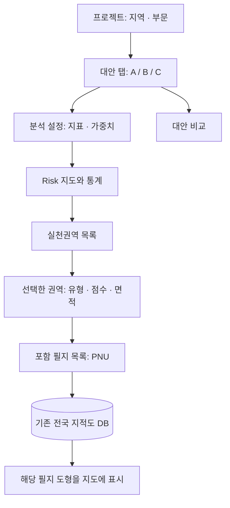

# 대안과 공통 필지 연결 — 2026-09-29

## 화면에서 이해하는 구조

현재 디자인과 대안 단위 저장은 유지한다. 후속 변경으로 대안·Risk·권역 고유 ID를 기존 저장 묶음 안에 추가했다(`PRIORITY_RESULT_IDENTITY.md`). 대안 버전·결과 테이블 분리는 아직 구현하지 않았다.

## 적용한 저장·조회 방식

- 기존 `pnuList`에 필지번호를 저장하고, 신규 로컬 도출 후보에는 `parcelDatasetVersion`을 함께 기록한다.
- `shared/map/cadastre.js`는 현재 설치된 전국 배포본 `vworld-2026-08-08`을 명시한다. DB 교체 시 이 값과 과거 버전 보존 정책을 함께 변경해야 한다. 여러 버전의 DB를 자동 선택하는 기능은 아직 없다.
- 저장본 복원은 주변 bbox 검색 대신 기존 `/cadastre/parcel?pnu=...` API로 최대 100개 PNU를 일괄 조회한다. 기존 단일 PNU 요청도 호환된다.
- 서버는 매개변수화된 `ANY(text[])` 조건으로 조회한다. 일치하지 않는 자료 버전은 409로 거부한다.
- 브라우저는 버전+PNU 기준으로 최대 12,000개 도형을 세션 동안 재사용한다. 전체 후보 PNU 목록은 유지하며 못 찾은 도형은 누락 개수를 표시한다.
- 과거 저장본에는 버전이 없으므로 현재 자료에서 직접 조회한다. 이를 당시 버전이 검증된 것으로 표시하거나 자동 변경하지 않는다.
- DB 저장 시 필지 도형을 중복 저장하지 않는 기존 축약 방식은 유지한다. 최초 권역 도출은 공간 교차 계산이 필요하므로 기존 공간 범위 조회를 유지한다.

## 검증 및 범위

- `node --test scripts/test-parcel-references.mjs`: 배치 경계, PNU 중복 제거, 잘못된 번호, 공유 도형 재사용, 누락 필지 목록 보존, 과거 저장본, 버전 충돌·조회 오류.
- 개발용 4173 빌드 `1790659779390` 적용. 실제 DB 105필지 조회를 2회 요청으로 완료했고 원본 도형과 일치했다. 세션 캐시 재사용 시 추가 요청 0회. 버전 불일치 409, 잘못된 PNU 400 확인. 측정 28ms는 이 표본 API 조회이며 전체 지도 로딩 시간은 아니다.
- 홍수 기준 및 폭염 화면에서 불러오기 창을 확인했고 콘솔 오류는 없었다. 두 화면 모두 저장본 0개로 표시되어 기존 저장본을 선택한 전체 복원 흐름은 미검증이다. 기존 DB 저장본을 삭제하거나 변경하지 않았다.
- 기존 저장본 DB 쓰기, 전국 지적도 수정, 외부 사이트 배포, 자동점검 주기 변경은 포함하지 않는다.

### 후속 공개 배포 — 2026-09-30

공개 빌드 `1790762633400`에서 홍수·폭염 각각 10개 권역을 도출하고, 격리 브라우저의 도형 없는 초안을 PNU 직접 조회로 복원했다. 권역 ID와 필지 연결을 유지하고 bbox 재검색 없이 도형이 복원됨을 확인했다. 운영 DB 쓰기와 지적도 변경은 없었다. 증거: `output/release-20260930/result-identity/report.json`. 배포 상세는 `PRIORITY_COMMON_REPOSITORIES.md` 참조.
