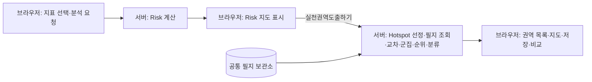

# 실천권역 도출의 서버 분리 — 2026-10-01

개발 플랫폼의 실천권역 도출을 브라우저에서 로컬 분석 서버로 옮겼다. 화면 디자인, 선정 기준, 대안·Risk·권역 ID 연결, 저장 형식은 유지했다. 현재 분석 서버는 이 Windows PC의 4173 서비스이며 별도의 클라우드 계산 서버를 만든 것은 아니다.

## 역할과 흐름



`SelectedRegionMap.svelte`에서 공간 연산 및 필지 검색 코드를 분리했다. 브라우저는 `practiceAreaClient.js`를 통해 `/practice-areas`에 요청하고 결과를 그린다. 공통 공간 함수는 `spatialGeometry.js`, 권역 계산은 `practice-area-engine.mjs`, 별도 계산 스레드는 `practice-area-worker.mjs`, 입력 검증·조회·실행 제한은 `practice-area-service.mjs`에 둔다. 지도 표시에 필요한 좌표 변환·경계 판정은 브라우저에도 남아 있다.

요청에는 `regionCode`, `hazard`, `sourceRiskResultId`, `candidateContextKey`와 **현재 Risk 격자 값**이 들어간다. 아직 독립된 Risk 결과 저장소가 없으므로 Risk ID만으로 서버가 결과를 다시 조회하는 방식은 아니다. 응답은 같은 연결 정보를 포함하고 브라우저와 상위 대안 처리부가 모두 일치 여부를 검사한다. 이전 분석의 늦은 응답은 현재 결과에 반영하지 않는다.

새로고침이나 저장본 복원에서는 기존 방식대로 `PNU + 지적도 버전`으로 공통 필지 도형을 조회한다. 저장된 결과를 다시 계산하지 않으며 기존 대안·Risk·권역 ID도 유지한다.

## 유지한 계산 기준

- Risk의 기존 상위 임계값으로 Hotspot을 고른다.
- 우선순위가 높은 최대 20개 작은 조회 구역을 사용한다.
- 상위 Hotspot 최대 600개와 필지를 교차하고, Risk 평균 순위 상위 650개 필지를 군집 대상으로 사용한다.
- 필지 중심 간 230m 기준, 기존 점수식으로 최대 10개 후보를 반환한다.
- 기존 시민실천·시설지원·계획행정의 **3개 유형 시연 분류**를 유지한다. 분류 모델을 새로 검증하거나 고도화한 작업은 아니다.

이는 전체 지역의 모든 필지를 빠짐없이 분석하는 새 알고리즘이 아니라 기존 알고리즘의 실행 위치를 옮긴 것이다. 같은 입력에 대한 결과 일치를 우선했다.

## 실패·동시 실행

입력은 알려진 부문·지역, 정렬된 EPSG:5179 100m 격자, 유효한 셀 번호와 값으로 제한한다. 필지의 교차·군집 계산은 별도 스레드에서 수행한다. 한 번에 한 실천권역 요청을 처리하고 중복 요청은 429 및 재시도 안내를 반환한다. Risk 계산의 동시 실행 제한과는 별개다.

서버 계산 제한은 기본 85초, 브라우저 요청 제한은 120초다. 대안 전환·컴포넌트 종료 시 요청을 취소하고 서버 계산 스레드도 정리한다. 이미 데이터베이스에 제출된 조회가 즉시 취소된다는 보장은 없다. 작업 큐나 브라우저 종료 후 작업을 이어가는 기능은 이번 범위에 포함하지 않았다.

일부 필지 조회 실패·조회 상한으로 남은 구역은 부분 분석으로 표시한다. PostGIS 조회가 실패하면 기존 VWorld 대체 조회를 유지하고 자료 출처를 표시한다. 계산 실패 시 이전에 완료한 권역과 ID를 보존한다. 브라우저 계산으로 조용히 대체하지 않는다.

## 적용 환경

- 기준: `http://127.0.0.1:4173/internal-tools/priority-management-area/flood?regionCode=41110`
- 내부 도구를 `/internal-tools` 기준으로 빌드하여 `pages-dist/internal-tools`에 반영했다.
- 개발 서빙 빌드: **1790822392750**.
- 4173 소유 프로세스를 확인하고 해당 Node 서비스만 재시작했다. 전국 토지피복 변환과 PostgreSQL 서비스는 계속 실행했다.
- 공개 요청 전달 경로와 빌드 경로도 소스에 추가하고 격리 검사했다. **이번 변경의 공개 UI·프록시는 아직 배포하지 않았다.**
- 이전 소스와 개발 서빙 파일은 `output/pre-practice-area-server-20261001/`에 보존했다. 저장 대안이나 사용자 데이터를 변경하지 않았다.

## 검증 결과

`npm run test:practice-area-server`: **13개 통과**. 이전 구현(`6142d46`)과의 일치, 서버 스레드 결과, 모든 지원 지역의 경계 선택, 잘못된 입력 거부, 부분 조회, 대체 자료, 요청 취소, 동시 실행 429와 재시도, 오래된 결과 격리, 공개 프록시의 요청 제한을 확인했다. 이전 구현 비교 검사는 해당 Git 커밋이 로컬 이력에 있어야 한다.

실제 수원 자료를 같은 입력으로 이전·새 계산에 넣은 결과:

| 부문 | Risk 유효 셀 | Hotspot | 조회 필지 | 교차 필지 | 최종 권역 | 최종 포함 필지 | 기존 결과와 비교 |
| --- | ---: | ---: | ---: | ---: | ---: | ---: | --- |
| 홍수 | 4,857 | 486 | 796 | 286 | 10 | 260 | PNU·도형·면적·점수·순위·분류 일치 |
| 폭염 | 12,095 | 1,210 | 1,836 | 1,110 | 10 | 624 | PNU·도형·면적·점수·순위·분류 일치 |

실제 Chrome 검증에서는 홍수 기준 화면을 먼저 열고, 홍수·폭염에서 다음을 확인했다.

1. 서버 Risk 계산 → `POST /practice-areas` 성공, 도출 중 브라우저 bbox 필지 조회 없음.
2. 각 10개 권역 표시, 부분 조회 0개, 배경지도 타일 각각 30개 로드.
3. 격리 브라우저에만 서버 실패 응답을 주입해 이전 권역·ID 보존 확인.
4. 새로고침 시 ID 유지, 도형 없는 저장본에서 PNU 조회로 복원.
5. 재도출 시 권역 ID 변경, 재분석 시 Risk ID 변경 및 이전 권역 초기화.
6. 페이지 실행 오류 0건. 원격 저장 요청은 차단하고 일회용 브라우저의 임시 저장소만 사용.

증거:

- `output/practice-area-server-20261001/browser-network/report.json`
- `output/practice-area-server-20261001/browser-network/baseline.json`
- `output/practice-area-server-20261001/browser-network/flood.png`, `heatwave.png`
- `output/practice-area-server-20261001/browser/live-legacy-parity.json`
- 재시작 후 개발·공개 기존 화면 및 조회 API HTTP 검사 **14/14 통과**: `output/platform-audit/2026-10-01T02-49-43-486Z/report.json`. 공개 새 실천권역 기능이나 일일 점검 전체 통과를 의미하지 않는다.

첫 격리 실행에서는 분석 검사가 통과했지만 외부 배경지도 표시를 확인하지 못했다. 외부 통신이 가능한 검증 실행에서 타일 로드까지 추가 확인했으며 위 `browser-network`가 최종 화면 증거다. 전국 모든 지역, 외부 공개 환경, 실제 공동 저장소 쓰기를 검증한 것으로 확대 해석하지 않는다.

실제 자료 재검증 명령:

```text
PLATFORM_TEST_OUTPUT=<새 증거 디렉터리>로 scripts/wbgt/verify-result-identity.py 실행
node scripts/tests/verify-practice-area-live.mjs <해당 증거 디렉터리>
```

일일 점검 기준은 `checks.json` 버전 10의 `server-practice-area-derivation`에 추가했다. 기존 하루 한 번 예약은 유지했다.

## 다음에 남는 분리

Risk와 실천권역의 주요 분석은 서버가 담당한다. 사용자 업로드 파일의 해석·전처리, 일부 저장본 복원·화면 상태 처리는 브라우저에 남아 있으므로 플랫폼 전체의 처리 분리가 모두 끝난 것은 아니다. 별도 원본 보관소, 독립 결과 저장소를 통한 ID만의 요청, 다중 사용자 작업 큐는 후속 작업이다.
